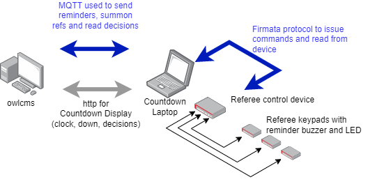

## MQTT

MQTT is used for communication between refereeing, jury and timekeeper devices built using Arduino, ESP32, Raspberry Pi and other affordable single board comptuers.

owlcms now includes an MQTT server to support these devices.

Several projects use MQTT for communication between devices and owlcms :

- Arduino/Firmata projects: the following projects are based on widely-used Arduino boards, but could actually run on any board that supports the Firmata protocol
  The two projects below provide software that connect owlcms to the devices.

  

  - [owlcms/owlcms-firmata Technical Official device integration for OWLCMS (github.com)](https://github.com/owlcms/owlcms-firmata)  This project includes diagrams for building your own devices using Arduino boards. Both the software to run on the Arduino and the driver to interface with owlcms are provided. The software is user-configured - you can change what pins on the board are used, and you can add or remove components as you see fit.  This project is the "build-it-yourself" cousin of the BlueOwl project below. 
  - [scottgonzalez/blue-owl: Technical Official device integration for OWLCMS (github.com)](https://github.com/scottgonzalez/blue-owl) is the originator of the Firmata integration with owlcms.  The project aims at creating commercially available devices thar fully comply with IWF rules and regulations.  The software base is freely licensed.

- ESP32 projects

  - https://github.com/jflamy/owlcms-esp32 contains Arduino code and simple circuit schematics to build a simple refereeing device with an indicator LED and a buzzer to remind a referee to enter a decision.  

  - https://github.com/kingbutter/owlcms4-ref-m5stack-core2 uses the M5Stack devices as a basis for touchscreen-based refereeing devices.


See [MQTT Messages](MQTTMessages) for details on how MQTT is for exchanging information.


### Optional configuration of the embedded MQTT server

By default, owlcms will start an MQTT server in anonymous mode. If there is no username,  any process can connect to the owlcms machine on port 1883 using any username and any password.

If you have a wired network with no wifi you might be comfortable doing that, but we do suggest that you add a  username and password.

##### Configuration using the user interface

The simplest way of doing this is using the user interface.  The values you set in these fields are the values you will use from your MQTT device controllers.


> These fields were previously used to configure how owlcms connected to an external server such as Mosquitto or aedes.  *They no longer control the external server.*  If you need to connect to an external server, you will need to use the [Using an External MQTT Server](#using-an-external-mqtt-server) method described at the end of this page

##### Configuration using the configuration file or environment variables

If you configure the MQTT Server in the database, the settings are valid when that database is in use.

If you want something more permanent you can use either environment variables or Java system properties.

On Windows, you can do as follows

1. Go to the installation directory, and locate the `owlcms.l4j.ini` file (depending on your Windows configuration, the `.ini` extension can be hidden).  
2. The following three properties can be defined -- they play the same role as the fields in the database.

```bash
# MQTT for refereeing devices
-DmqttUserName=owlcms
-DmqttPassword=some_Password_you_choose
-DmqttPort=1883
```

> NOTE that the variable `mqttServer` is NOT defined (see the next section)

3. You can also use the three equivalent environment variables OWLCMS_MQTTUSERNAME, OWLCMS_MQTTPASSWORD and OWLCMS_MQTTPORT


## Using an External MQTT Server

The Fly.io service doesn't allow for the owlcms server to provide both HTTP and MQTT services.  For these situations, we must use a separate server and define the environment variable OWLCMS_MQTTSERVER to indicate its location.  There is no need to use a separate MQTT server when using owlcms locally as the performance of the embedded server is on par with standalone servers.

As soon as owlcms detects OWLCMS_MQTTSERVER, it disables the embedded server and uses instead the parameters given to reach the external MQTT Server.  The external MQTT server cannot be configured using the Web interface.

HiveMQ provides free accounts ([see here](https://console.hivemq.cloud)) that are sufficient for running owlcms.  To use such an account, you would define "*secrets*" on fly.io -- they are stored in an encrypted format.   owlcms sees them as environment variables. You need to provide the following values (obviously, use your own values).:

| Variable            | Value                                                        |
| ------------------- | ------------------------------------------------------------ |
| OWLCMS_MQTTSERVER   | 44341a3e47cc48d2b260b8064120f2df.s2.eu.hivemq.cloud          |
| OWLCMS_MQTTPORT     | 8883 (external servers require a TLS connection, owlcms will use TLS if the port starts with 8) |
| OWLCMS_MQTTUSERNAME | your_username (one of the user names you created using the Access Management > Credentials page) |
| OWLCMS_MQTTPASSWORD | some_Password_you_choose (the password associated with the credential) |

For testing, you might want your local owlcms to connect to the remote MQTT.  This can also be done using -D system property definitions instead of variables.   You would then modify the `owlcms.l4j` initialization file in the installation directory to have the following (or add these values to the `java` command line)

```bash
-DmqttServer=44341a3e47cc48d2b260b8064120f2df.s2.eu.hivemq.cloud
-DmqttUserName=your_username
-DmqttPassword=some_Password_you_choose
-DmqttPort=8883
```

